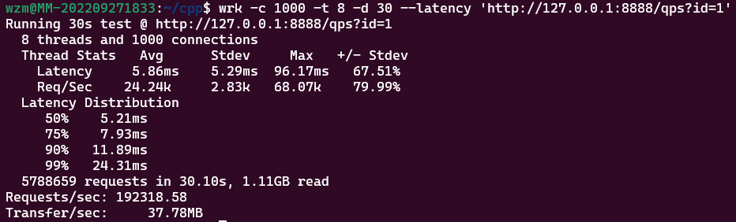

# 一、概述
CORPC是一款基于协程的异步RPC框架，其中用到的协程库[cppco](https://github.com/GoblinsWang/cppCo)为本人的另一个开源项目。
## 1.1 CORPC支持的协议报文
**CORPC** 框架目前支持两类协议：
1. 纯 **HTTP** 协议: CORPC 实现了简单的很基本的 HTTP(1.1) 协议的编、解码，完全可以使用 HTTP 协议搭建一个 RPC 服务。
2. PB 协议: 一种基于 **Protobuf** 的自定义协议，属于二进制协议。

# 二、性能测试
## 2.1 HTTP echo 测试 QPS
环境配置：windows下的wsl，CPU为**12核**

测试方法：[wrk](https://github.com/wg/wrk.git) 与 corpc 服务部署在都在同一个wsl中, 然后关闭CORPC的日志。

测试结果：

从上图的测试结果可知，CORPC的QPS达到了19w+。
# 三、其他
## TODO:
- 时间轮算法 √
- pb及rpc实现 √
- 应用libco中的上下文切换汇编代码 √
- 实现非阻塞异步的RPC调用
- 实现m:n协程，采用共享协程池的模式
